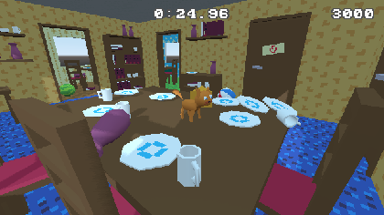
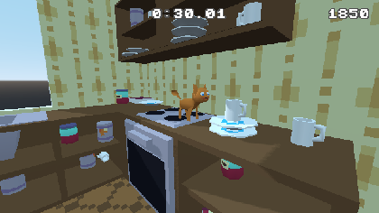

# Piper The Cat

Did you ever wonder what would it be like to be a cat? No wonder no more! In this game you're Piper the CAT! Try to rearrange items found in the household, touch 'em, smash 'em, just introduce your chaos!

This game is still unfinished and buggy, if you experience performance loss on the web platform, try to download the executable, it should work way better.

Game made for 80th MiniJam's game jam -
https://itch.io/jam/mini-jam-80-cats

## Controls

WASD - Movement
 Space - Jump
 Mouse - Look around

## Credits

Programming - Konrad Nowakowski
Graphics - Konrad Nowakowski

Thanks for providing free assets to:
 Music - Shool Of Quirks by Zander Noriega
 https://opengameart.org/content/school-of-quirk
 SFX - Breaking bottle by spookymodem
 https://opengameart.org/content/breaking-bottle
 SFX - Impact (comes from Ledge sfx) by Yo Frankie
 https://opengameart.org/content/bone-fall-ledge-climbing-impact-yo-frankie
 Font - Modern DOS 8x8 by Jayvee Enaguas
 https://www.dafontfree.net/freefonts-modern-dos-8x8-f166119.htm
